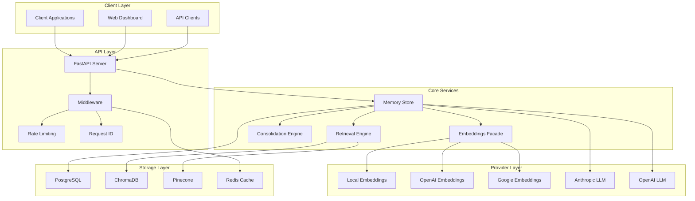
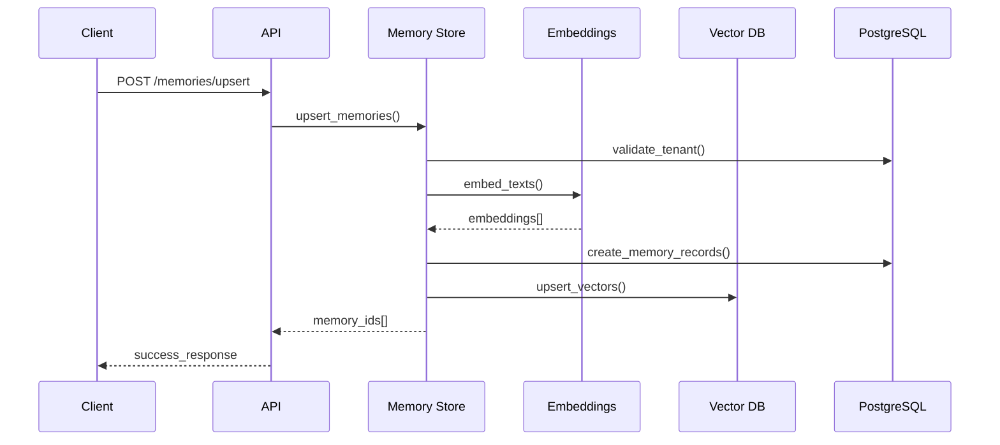
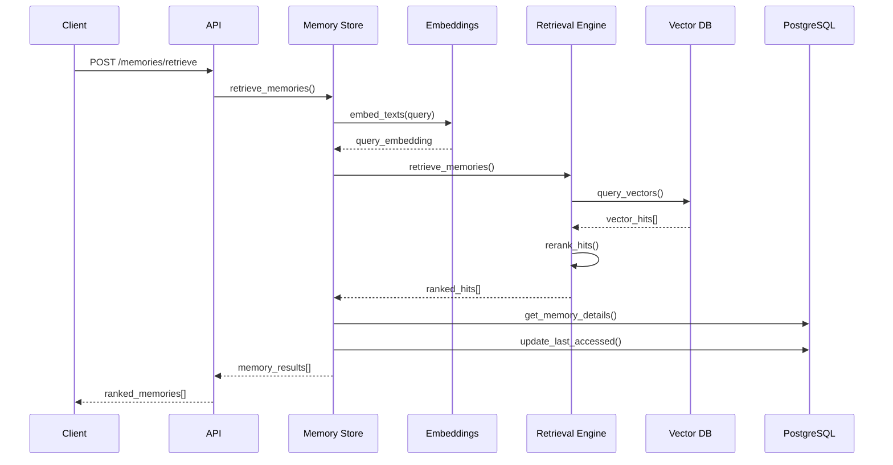
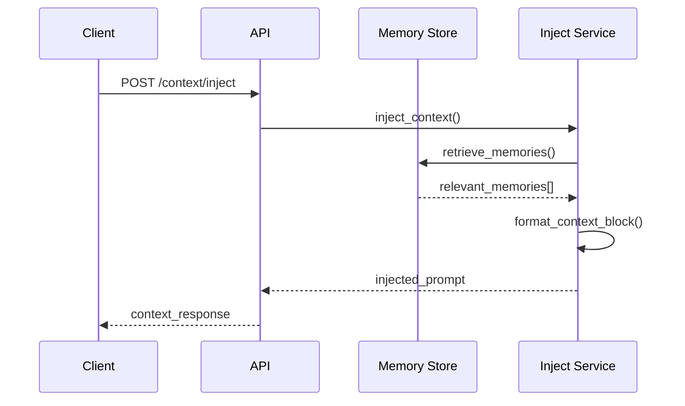
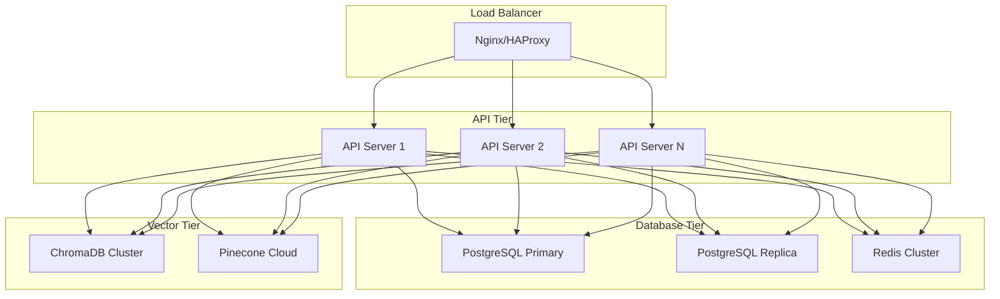

# Engram Architecture

## Overview

Engram is a provider-agnostic semantic memory service designed to store, retrieve, and consolidate memories for LLM applications. The architecture emphasizes modularity, scalability, and multi-tenant isolation while maintaining sub-100ms retrieval performance.

## System Architecture



## Core Components

### 1. Memory Store (`engram.core.memory_store`)

The central orchestrator that manages memory lifecycle and coordinates between storage layers.

**Responsibilities:**
- CRUD operations for memories and tenants
- Orchestrating embeddings generation
- Managing vector database operations
- Maintaining user statistics
- Handling transaction rollbacks

**Key Features:**
- Multi-tenant isolation via tenant_id + user_id
- Automatic text truncation with metadata preservation
- Batch operations for efficiency
- Soft delete with background cleanup

### 2. Retrieval Engine (`engram.core.retrieval`)

Implements semantic search with composite scoring for relevance ranking.

**Scoring Formula:**
```
composite_score = α * cosine_similarity + β * recency_boost + γ * importance - δ * decay_penalty
```

Where:
- α = 0.70 (cosine similarity weight)
- β = 0.20 (recency boost weight)
- γ = 0.15 (importance weight)
- δ = 0.05 (decay penalty weight)

**Recency Boost:**
```
recency_boost = exp(-days_since_access / τ)
τ = 14 days (configurable)
```

**Decay Penalty:**
```
decay_penalty = (age_days / 365) * (1 - decay_weight)
```

### 3. Consolidation Engine (`engram.core.consolidation`)

Manages memory lifecycle through similarity-based consolidation and forgetting policies.

**Consolidation Process:**
1. Find memory clusters using similarity threshold (default: 0.97)
2. Sort by creation time (oldest becomes target)
3. Merge text content intelligently
4. Recompute embeddings
5. Aggregate metadata and increment merge_count
6. Soft delete source memories

**Forgetting Policy:**
- Memories with importance < 0.2
- Not accessed in > 30 days
- Automatic background cleanup

### 4. Embeddings Facade (`engram.core.embeddings`)

Provider-agnostic interface for embedding generation with automatic fallback.

**Supported Providers:**
- **Local**: sentence-transformers (all-MiniLM-L6-v2)
- **OpenAI**: text-embedding-3-small
- **Google**: textembedding-gecko

**Features:**
- Automatic provider fallback
- Batch processing
- Dimension validation
- Caching support

## Data Flow

### Memory Storage Flow



### Memory Retrieval Flow



### Context Injection Flow



## Multi-Tenant Architecture

### Tenant Isolation

All operations are scoped by `tenant_id` and `user_id`:

```python
namespace = f"{tenant_id}:{user_id}"
```

This ensures:
- Complete data isolation between tenants
- User-level memory separation within tenants
- Scalable multi-tenant architecture
- Easy data migration and backup

### Resource Management

**Per-Tenant Limits:**
- Memory storage: 10M memories (soft cap)
- Text length: 2048 characters (hard limit)
- Rate limiting: 60 requests/minute per client

**Per-User Limits:**
- Active memories: 10K (configurable)
- Memory retention: 365 days (configurable)

## Performance Characteristics

### Latency Targets

| Operation | Target (p95) | Notes |
|-----------|--------------|-------|
| Memory Retrieval | < 100ms | With warm cache |
| Memory Upsert | < 200ms | Batch of 10 memories |
| Context Injection | < 150ms | With 6 memories |
| Health Check | < 50ms | Basic connectivity |

### Scalability

**Horizontal Scaling:**
- Stateless API servers
- Shared PostgreSQL database
- Distributed vector databases
- Redis for session/rate limiting

**Vertical Scaling:**
- Embeddings caching
- Database connection pooling
- Vector index optimization
- Memory-efficient batch processing

## Security Model

### Authentication & Authorization

Currently supports API key-based authentication with plans for:
- OAuth 2.0 integration
- JWT token validation
- Role-based access control (RBAC)
- Tenant-level permissions

### Data Protection

**Encryption:**
- TLS 1.3 for data in transit
- AES-256 for data at rest (database)
- Vector embeddings are not encrypted (performance)

**Privacy:**
- No cross-tenant data leakage
- Configurable data retention policies
- GDPR compliance features
- Audit logging for all operations

### Input Validation

- Pydantic v2 models for request validation
- Text length limits and sanitization
- SQL injection prevention via ORM
- Rate limiting and abuse prevention

## Deployment Architecture

### Container Deployment



### Configuration Management

**Environment Variables:**
- Provider API keys
- Database connection strings
- Feature flags
- Performance tuning parameters

**Secrets Management:**
- Kubernetes secrets
- HashiCorp Vault integration
- Environment-specific configs
- Secure key rotation

## Monitoring & Observability

### Metrics

**Application Metrics:**
- Request latency (p50, p95, p99)
- Error rates by endpoint
- Memory operations per second
- Embedding generation time
- Vector query performance

**Business Metrics:**
- Active tenants and users
- Memory storage growth
- Consolidation effectiveness
- Forgetting policy impact

### Logging

**Structured Logging:**
- JSON format for production
- Request tracing with correlation IDs
- Error context and stack traces
- Performance timing data

**Log Levels:**
- ERROR: System errors and exceptions
- WARN: Recoverable issues and fallbacks
- INFO: Important business events
- DEBUG: Detailed operation traces

### Health Checks

**Liveness Probe:**
- Basic API connectivity
- Database connection
- Vector database availability

**Readiness Probe:**
- All dependencies healthy
- Warm embeddings cache
- Accepting requests

## Future Enhancements

### Planned Features

1. **Advanced Consolidation**
   - ML-based similarity detection
   - Topic modeling for memory clustering
   - Automatic importance scoring

2. **Enhanced Providers**
   - Cohere embeddings support
   - Azure OpenAI integration
   - Custom model hosting

3. **Analytics Dashboard**
   - Memory usage insights
   - Performance analytics
   - Tenant management UI

4. **Enterprise Features**
   - SSO integration
   - Advanced RBAC
   - Compliance reporting
   - Data export/import

### Scalability Improvements

1. **Caching Strategy**
   - Embeddings cache warming
   - Query result caching
   - Distributed cache layers

2. **Database Optimization**
   - Read replicas for analytics
   - Partitioning by tenant
   - Automated archiving

3. **Vector Database Scaling**
   - Multi-region deployment
   - Automatic sharding
   - Query optimization

This architecture provides a solid foundation for a production-ready semantic memory service while maintaining flexibility for future enhancements and scaling requirements.
